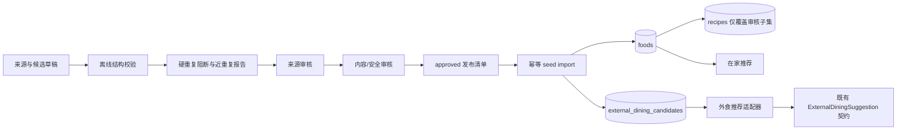

# 500+ 结构化候选库技术设计

## 1. 设计结论

采用“两个候选目录 + 一个独立 Recipe 层”的结构：

1. 家庭候选继续以 `foods` 为主实体，在不破坏现有接口的前提下补充结构化目录字段；
2. 外食方向从 `external_dining.py` 的硬编码元组迁入独立的 `external_dining_candidates` 数据集/表；
3. `recipes` 仍与家庭候选一对一关联，只覆盖真正达到完整菜谱质量门的子集；
4. 两类候选共享分类、来源、审核、季节和稳定身份规范，但不强行共用一张“万能表”。万能表通常最后既不万能，也不像表。

本设计只定义后续实施方案，不在规划阶段修改模型、迁移、种子或服务。

## 2. 现状约束

现状详见 [research/catalog-audit.md](./research/catalog-audit.md)，设计必须兼容以下事实：

- `food_seed.json` 有 205 个唯一名称，当前已满足家庭候选数量下限；
- `recipe_seed.json` 有 120 个 Recipe，角色固定为 50/50/20；
- `external_dining.py` 仅有 57 个规则候选（36 个个人、21 个共享）；
- 家庭 seed 导入按可变的 `name` upsert，外食历史键由 `category:dish_name` 哈希生成；
- 现有推荐会读取 `nature`、`seasonal_solar_terms`、体质及忌口字段；
- 现有 API 仍需要 `meal_format`、`serving_style` 和稳定 suggestion key；
- 生产数据库为 CloudBase MySQL，测试/开发还需兼容 SQLite。

## 3. 目标架构

关键边界：

- 来源抓取/整理不直接写生产；
- 只有 `approved` 记录才能生成发布 seed；
- 导入器不负责“猜字段”，只负责验证后的幂等落库；
- 推荐器不读取草稿和驳回记录；
- Recipe 数量与 Candidate 数量分别统计。

## 4. 逻辑数据契约

### 4.1 公共字段

| 字段 | 类型 | 允许值/格式 | 语义与质量规则 |
|---|---|---|---|
| `catalog_key` | string | `home:<slug>:v1` / `external:<slug>:v1` | 永久稳定且全目录唯一；展示名、分类变更不改 key |
| `candidate_kind` | enum | `home`、`external` | 决定类型专属校验与存储 |
| `display_name` | string | 1–64 字符 | 面向用户；标准化后不可与同类型其他记录硬重复 |
| `aliases` | string[] | 去重、非空字符串 | 只用于查找/历史名称，不计入候选数 |
| `meal_family` | registry key | 见 4.2 | 大类，用于覆盖率与首层多样性 |
| `sub_family` | registry key | 受 `meal_family` 约束 | 细分餐型；外食适配为现有 `meal_format` |
| `cuisine_region` | registry key | 见 4.2 | 表示主要饮食传统；无法判断用 `unknown` |
| `staple_type` | enum | 见 4.3 | 主食形态；没有主食用 `none`，不确定用 `unknown` |
| `protein_types` | enum[] | 见 4.3 | 主要蛋白来源；`none` / `unknown` 与其他值互斥 |
| `serving_style` | enum | `individual`、`shared`、`either` | 个人、共享或两者均适用 |
| `meal_periods` | enum[] | `breakfast`、`lunch`、`dinner`、`late_night`、`snack`、`any` | 非空；`any` 与其他值互斥 |
| `delivery_fit` | enum | `high`、`medium`、`low`、`not_applicable`、`unknown` | 基于 4.4 的可解释量表，不声称实时配送能力 |
| `price_band` | enum | `budget`、`standard`、`premium`、`unknown` | 相对每人份成本/客单，不存伪精确实时价格 |
| `seasonal_solar_terms` | enum[] | 24 节气键或 `all_season` | 100% 非空；`all_season` 与具体节气互斥 |
| `nature` | enum | `cold`、`cool`、`neutral`、`warm`、`hot`、`unknown` | 文化/偏好层标签；无可靠依据必须 `unknown` |
| `source_url` | URL | HTTPS | 发布记录的主要来源；不能是搜索结果页 |
| `source_type` | enum | `government_data`、`original_publisher`、`restaurant_menu`、`professional_recipe`、`other_reviewed` | 明确来源层级，禁止把“来自网络”当依据 |
| `source_checked_at` | datetime | ISO 8601 UTC | 最近一次确认来源可访问且支持相关事实的时间 |
| `review_status` | enum | `draft`、`source_verified`、`content_reviewed`、`approved`、`rejected`、`retired` | 线上只读取 `approved` |
| `reviewed_by` | string/null | 审核主体标识 | `content_reviewed`、`approved`、`rejected`、`retired` 必填 |
| `reviewed_at` | datetime/null | ISO 8601 UTC | 与最终审核动作配套 |
| `review_notes` | string/null | 简明事实记录 | 记录来源边界、估算、争议和退役原因 |
| `is_active` | bool | true/false | 软停用；`retired` 必须为 false |
| `version` | int | >=1 | 内容变化递增，稳定 key 不变 |

建议增加以下伴随字段，避免把一条 URL 强行承担所有证据：

- `nutrition_source_url`：存在数字营养或能量范围时指向营养数据来源；
- `nutrition_basis`：说明按每 100 克、每份还是商户标示，以及是否为估算；
- `source_snapshot_hash`：可选的来源快照摘要，用于发现内容漂移；
- `taxonomy_version`：记录词表版本，便于后续迁移。

### 4.2 `meal_family`、`sub_family` 与 `cuisine_region`

首版 `meal_family` 词表：

| key | 说明 | 示例 `sub_family` |
|---|---|---|
| `single_dish` | 单道家常菜或单品 | `stir_fry`、`steamed_dish`、`stewed_dish`、`cold_dish` |
| `rice_meal` | 以米饭为中心的一人餐 | `rice_bowl`、`fried_rice`、`braised_rice`、`curry_rice` |
| `noodle_meal` | 面、粉、米线、河粉 | `noodle_soup`、`dry_noodle`、`rice_noodle_soup` |
| `grain_congee` | 粥、杂粮碗、谷物套餐 | `congee`、`grain_bowl` |
| `soup_meal` | 汤羹或汤菜组合 | `light_soup_set`、`stew_soup_set` |
| `dumpling_bun` | 饺、馄饨、包点 | `dumpling`、`wonton`、`steamed_bun`、`dim_sum` |
| `wrap_light_meal` | 卷饼、沙拉、轻食 | `wrap`、`salad_set`、`sandwich` |
| `set_meal` | 一人份定食/套餐 | `balanced_plate`、`steamed_set`、`roast_set` |
| `shared_dishes` | 多人合菜/共享套餐 | `homestyle_share`、`regional_share` |
| `hotpot_grill` | 火锅、烤鱼、烧烤等共享形式 | `hotpot`、`grilled_share` |
| `snack_dessert` | 小吃、点心、甜品 | `snack`、`dessert` |
| `other` | 无法归入以上类型 | `other` |

约束：`sub_family` 存机器键，展示层另做中文映射；新增词条必须更新版本化 registry 与测试，不能让运营随手造一个只出现一次的类别。

`cuisine_region` 不做一个永远写不完的硬编码大枚举，采用版本化 registry：

- 中国通用及地域：`cn_national`、`cn_northeast`、`cn_beijing_tianjin`、`cn_shandong`、`cn_jiangzhe`、`cn_fujian`、`cn_cantonese`、`cn_hakka`、`cn_sichuan`、`cn_hunan`、`cn_yunnan_guizhou`、`cn_northwest`、`cn_hainan` 等；
- 国际地域：`east_asia_*`、`southeast_asia_*`、`south_asia_*`、`middle_east_*`、`europe_*`、`americas_*`；
- 通用兜底：`fusion`、`other`、`unknown`。

registry 必须记录 key、中文名、父级、启用状态和别名。展示名不作为数据库枚举。

### 4.3 主食与蛋白词表

`staple_type`：

`rice | wheat_noodle | rice_noodle | wheat_bread | dumpling_wrapper | whole_grain | congee | tuber | corn | mixed | none | other | unknown`

`protein_types`：

`egg | poultry | pork | beef | lamb | fish | crustacean | mollusk | dairy | soy | legume | nut_seed | none | other | unknown`

规则：

- 按主要成分标注，可多选；不把少量调味或装饰性食材算主要蛋白；
- `none`、`unknown` 都只能单独出现；
- 该字段不是过敏原字段。过敏原/忌口仍由明确的 `forbidden_tags` 与食材表驱动；
- 当前 `tags` 中 `seafood`/`fish` 粒度混乱，迁移时保留旧 tag 兼容，同时由审核者映射到新词表。

### 4.4 `delivery_fit` 量表

用四项风险检查，避免拍脑袋：

1. 温度变化后是否明显失去基本可食用品质；
2. 是否有高汤汁/洒漏风险；
3. 是否会快速塌软、回潮、分层或凝结；
4. 分量、共享或组装是否高度依赖现场服务。

| 风险项数量 | 值 | 含义 |
|---:|---|---|
| 0–1 | `high` | 常规外带/配送可执行 |
| 2 | `medium` | 可配送，但需要分装或备注 |
| 3–4 | `low` | 更适合到店，不作为默认配送方向 |
| 无法判断 | `unknown` | 待审核，不允许审核者硬猜 |
| 家庭候选不适用 | `not_applicable` | 家庭候选默认值 |

### 4.5 `price_band` 口径

- 家庭候选：以常见食材的相对每人份成本分为 `budget/standard/premium`；
- 外食方向：以同城市常规一人客单的相对等级表达，不存实时金额；
- 若来源没有可靠价格信息，填 `unknown`；
- 价格会随城市、时间和商户变化，因此只能用于弱排序/筛选，不能向用户展示成报价承诺。

### 4.6 季节、性味与传统标签

- `seasonal_solar_terms` 只表达季节性可获得性、传统食用语境或产品内容偏好；
- `all_season` 表示全年适用且不给节气加分，不等于“全年最健康”；
- 具体节气必须有来源或清楚的人工审核依据；现有 102 条空列表迁移时先回填 `all_season`，再逐条复核，不能批量随机分配；
- `nature=unknown` 在推荐评分中走中性基准；不应因为“不知道”被扣分；
- `organ_meridians`、`suitable_constitutions`、`forbidden_for` 作为 legacy 可选字段保留，但不得自动生成。缺乏可靠依据时为空；尤其不能把体质标签与过敏/食品安全硬限制混为一谈；
- 描述层移除未经来源支持的“清热解毒、祛湿、补气血、降火”等功效断言。若保留文化背景，必须明确为传统饮食说法且不进入健康评分理由。

## 5. 物理存储设计

### 5.1 `foods` 增量字段

在现有 `foods` 表上增量增加：

- 标量：`catalog_key`、`meal_family`、`sub_family`、`cuisine_region`、`staple_type`、`serving_style`、`delivery_fit`、`price_band`、`source_url`、`source_type`、`source_checked_at`、`review_status`、`reviewed_by`、`reviewed_at`、`review_notes`、`is_active`、`version`、`taxonomy_version`；
- JSON：`aliases_json`、`protein_types_json`、`meal_periods_json`；
- 可选营养来源：`nutrition_source_url`、`nutrition_basis`。

索引：

- `catalog_key` 唯一索引；
- `(review_status, is_active)` 组合索引；
- `meal_family`、`sub_family`、`cuisine_region`、`serving_style` 单列索引；
- JSON 数组首版不承担数据库复杂过滤，服务读取已批准候选后在内存做集合过滤，避免 SQLite/MySQL JSON 方言差异拖垮首版。

迁移先允许新列 nullable，完成回填与验证后再收紧应用层约束；MySQL 大表加列需独立演练，但当前 205 行规模不是性能问题，真正的问题是回滚和内容正确性。

### 5.2 `external_dining_candidates` 新表

除 4.1 公共字段外，包含：

- `dish_name`（展示名）；
- `category`（兼容现有中文分类，后续仅展示）；
- `forbidden_tags_json`；
- `energy_kcal_min_per_person` / `energy_kcal_max_per_person`；
- `nutrition_note`；
- `order_tips_json`；
- `high_protein`（可由蛋白/营养资料派生，首版可保留兼容）；
- `created_at` / `updated_at`。

`sub_family` 通过适配器输出为现有 `meal_format`。现有 57 条规则先分配稳定 `catalog_key`；旧 SHA1 key 建立 `legacy_key_alias` 映射，使历史曝光记录和 request replay 在过渡期仍能解析。

### 5.3 `recipes` 与审核清单

`recipes` 一对一关联不变，不把外食方向塞进 Recipe。现有 `source_url` 和 `nutrition_basis` 继续使用。

`recipe_review_manifest.json` 升级为覆盖全量 Recipe 的版本化清单，至少包含：

- `food_name` / 未来可用 `catalog_key`；
- `recipe_version`；
- `review_status`；
- `checks`；
- `reviewed_by` / `reviewed_at`；
- `source_url` / `nutrition_source_url`；
- 数据集摘要。

现有 120 份菜谱先做基线快照，不因字段迁移重写内容；新增以最多 30 份为一批。

## 6. 去重设计

### 6.1 名称规范化

生成 `normalized_name`，规则固定并有测试：

1. Unicode NFKC；
2. 去首尾空白、连续空白归一；
3. 全角/半角括号、`+`、`＋`、`&` 等分隔符统一；
4. 中文标点统一；
5. 别名映射（如“云吞/馄饨”）只用于近重复召回，不用于自动合并。

不得粗暴删除“鱼、鸡、饭、面”等核心词，也不得把“牛肉面”和“鸡肉面”归成一条。算法若靠删关键字得到高召回，顺手也把常识删了。

### 6.2 三层判定

1. **硬重复，阻断**：`catalog_key` 冲突、同类型 `normalized_name` 相同、同批 source+source item id 相同；
2. **结构重复，阻断或要求显式 variant**：`candidate_kind + meal_family + sub_family + staple_type + sorted(protein_types) + serving_style + canonical_base_name` 相同；
3. **近重复，人工复核**：名称 token Jaccard/字符相似度达到阈值，或核心结构相同但只差“配青菜、少油版、套餐、小份”等修饰。

允许保留 variant 的条件：至少一个推荐上有实质意义的字段不同，例如主蛋白、主食形态、供应方式、核心烹饪方式或可验证地域风格；同时写 `variant_of` 和差异说明。别名和 variant 都不应靠改名字逃过审核。

### 6.3 跨目录去重

家庭单菜与外食组合可同时存在，但不得假装完全独立：

- exact name 跨目录只告警，不自动合并；
- 外食组合若只是在家庭候选名后加“配米饭/配青菜”，必须检查是否真的形成不同的用餐方向；
- 多样性统计可用公共字段识别同源餐型，避免连续返回“番茄鸡蛋”“番茄鸡蛋盖饭”“番茄鸡蛋面”。

## 7. 来源与审核设计

### 7.1 来源优先级

1. 政府/公共营养数据库与正式指南；
2. 原始发布者、品牌/餐厅正式菜单；
3. 有编辑责任、作者与可复现配方的专业菜谱来源；
4. 其他来源仅在人工核实后使用。

搜索引擎、聚合摘要、二次转载只用于发现来源，不能成为 `source_url`。

### 7.2 审核状态机

| 当前状态 | 可进入 | 条件 |
|---|---|---|
| `draft` | `source_verified` / `rejected` | 结构有效、无硬重复，来源可访问且支持核心事实 |
| `source_verified` | `content_reviewed` / `rejected` | 分类、主要食材/餐型、价格/配送口径、节气/性味边界完成复核 |
| `content_reviewed` | `approved` / `rejected` | 安全文案、营养口径、禁止承诺、分布质量门全部通过 |
| `approved` | `retired` / 回到 `draft` | 来源失效、内容变化、法规/安全问题或重新编辑 |
| `rejected` | `draft` | 有明确修订理由后重新提交 |
| `retired` | `draft` | 重新评估并生成新版本，不直接复活 |

离线 URL 检查分成两种模式：

- `--offline`：结构、HTTPS、域名/路径和审核元数据检查，稳定用于 CI；
- `--check-sources`：实际访问来源、记录状态/重定向/内容摘要，供发布审核运行。网络瞬时失败进入人工复核，不能在导入时静默改成 approved。

### 7.3 营养与表述

- 家庭候选的每 100 克营养和 Recipe 的每份营养必须分别说明口径；
- 外食只保留宽区间及“门店配方和分量未知”的边界，除非正式菜单提供数值；
- 数值范围必须满足 `min <= max`，并设合理上界检查，但上界不等于来源证据；
- 禁止承诺扫描覆盖 `description`、`nutrition_note`、`order_tips`、Recipe 步骤和 `nutrition_basis`，不再只扫 Recipe；
- 审核者不能把 `nature`、归经或节气映射成治疗性理由。

## 8. 分批导入设计

每批都执行“草稿 → 校验 → 去重 → 来源审核 → 内容审核 → dry-run → staging import → 推荐回归 → 生产 import”。

| 批次 | 范围 | 目标 | 发布门 |
|---|---|---|---|
| B0 基线冻结 | 205 家庭、120 Recipe、57 外食 | 生成稳定键、名称快照、旧 key 映射和审计报告 | 内容零丢失，旧接口全绿 |
| H1–H5 | 每批约 40–45 个现有家庭候选 | 补齐公共字段、来源与审核；清理不实功效文案 | 每批 100% 字段门、0 硬重复 |
| H6 可选 | 0–45 个家庭候选 | 仅补分类/蛋白/时段覆盖缺口，家庭总量不超过 250 | 证明不是近重复凑数 |
| E1–E3 | 每批 50 个个人外食方向 | 先覆盖饭、面、粉、粥、轻食、定食等个人餐型 | 累计个人方向 >=150 |
| E4–E5 | 每批 45 个共享外食方向 | 覆盖合菜、锅物、地域共享餐等 | 累计共享方向 >=90 |
| E6 | 60 个缺口修复方向 | 按前五批分布报告补地域、主食、蛋白、时段和配送缺口 | 外食总量 300–320，分布门全过 |
| R1–R4 | 每批最多 30 个 Recipe | 从 120 逐步到 150、180、210、240；到 180 后可按产品需求停止 | 每批独立审核与回归 |

E1–E6 的批次数量是**最终 300–320 条外食发布集的分区**，其中必须纳入并复核现有 57 条，不是在旧 57 条之上再新增 300 条。E6 至少补足 30 个 `individual`，使最终精确 `individual` 不少于 180；`either` 可在运行时服务两类 audience，但不重复计数，也不用于满足 `individual >=180` 或 `shared >=90` 的最低配额。

外食批次不按“先把名字写够”验收，而按分类矩阵缺口验收。每批发布前生成 `meal_family × serving_style × staple_type × protein_types × meal_periods` 分布报告。

## 9. 迁移与发布

### 9.1 数据库迁移顺序

1. 新增 nullable 字段和外食候选表，不改变读路径；
2. 导入 B0 稳定键和 legacy key 映射；
3. 按 H/E 批次回填 approved 数据；
4. 新外食读取路径在功能开关下启用：DB 有合格候选时读 DB，否则读现有 `RULE_CANDIDATES`；
5. 影子比较新旧结果的数量、硬过滤、格式多样性、历史轮换和 replay；
6. 小流量切换并观察空候选率、回退率、重复率、审核版本；
7. 稳定后才停止维护硬编码候选；旧字段和旧表至少跨一个发布周期后再讨论清理。

### 9.2 导入幂等

- 家庭与外食均按 `catalog_key` upsert；
- `name`/`dish_name` 只作为可变内容，不再作为唯一业务身份；
- import 默认不删除数据库中 seed 未出现的记录；
- seed 想停用记录必须显式 `is_active=false` / `review_status=retired`，不能用“从 JSON 删除”表达；
- dry-run 输出 create/update/unchanged/retire/conflict 数量与目标 key；
- 批次失败必须整批回滚事务。

### 9.3 回滚

- 关闭新目录读取开关，立即回到现有 57 条规则和既有家庭候选；
- 保留新增列/表，不在事故期间做 destructive downgrade；
- 通过批次版本将误发布记录设为 `retired`，不物理删除；
- request replay 优先用 legacy key alias 解析，找不到时返回既有“原推荐方向已失效”错误；
- Recipe 单独回滚到上一个 seed/manifest 摘要，不回滚候选目录。

## 10. 推荐兼容策略

### 家庭推荐

- 新分类先用于统计与多样性，不立即替换现有 `category/cooking_method/meal_role`；
- `nature=unknown` 走当前 neutral/other 的中性基准；
- `[all_season]` 表示不加节气分，不等于缺失；
- 无可靠体质字段时不加分、不扣分，更不能作为硬安全过滤；
- 过敏/明确忌口继续在食材和 `forbidden_tags` 上先做硬过滤。

### 外食推荐

- 仅查询 `approved AND is_active` 且 `serving_style` 与 audience 匹配的记录；`either` 可进入两类；
- 数据记录适配成现有 `RuleCandidate`/`ExternalDiningSuggestion` 形状，API 不改；
- `catalog_key` 作为新 suggestion key；过渡期可解析旧 SHA1；
- 继续在硬过滤后做质量带探索、七日曝光去重和批内 `meal_format` 多样性；
- `sub_family` 映射为 `meal_format`，同一批优先不同 `meal_family`，再优先不同 `sub_family`。

## 11. 校验与测试策略

### 11.1 离线校验器

1. 扩展 `validate_food_seed.py`：新字段、`nature=unknown`、`all_season`、来源/审核、声明扫描、稳定键和 205–250 数量模式；
2. 新增 `validate_external_dining_seed.py`：300–320 数量、个人/共享、能量范围、受控词表、分布门、来源和近重复报告；
3. 改造 `validate_recipe_seed.py`：保留 120 基线集合检查，新增可配置目标范围与 `--batch-manifest`，不再把生产数据永久锁死在恰好 120；
4. 新增跨目录 `validate_candidate_catalog.py`：稳定键、跨目录近重复、总数、分类矩阵和审核状态汇总；
5. 所有脚本结构失败返回 1；近重复待审返回独立非零码或显式 review report，不能用普通 warning 混过去。

### 11.2 自动化测试

- **模型/迁移**：SQLite 升降级、MySQL DDL 审查、唯一索引、JSON 默认值、旧行 nullable 回填；
- **导入器**：首次导入、二次幂等、展示名改名、冲突、事务回滚、非 destructive、retire；
- **validator**：每个枚举非法值、数组互斥、source URL、声明扫描、精确/结构/近重复、数量与分布边界；
- **家庭回归**：205 旧候选名称集合不丢失，120 Recipe 可读，50/50/20 不变；
- **外食回归**：个人/共享过滤、忌口优先、三条不同 format、十轮覆盖、七日历史、request replay、旧 key alias；
- **行为边界**：`unknown` nature 中性、`all_season` 不加季节分、草稿不进入推荐、来源失效不在运行时自动删除；
- **API 契约**：现有 ExternalDiningResponse 和 Food/Recipe schema 不发生未版本化破坏。

### 11.3 发布质量报告

每次发布生成机器可读 JSON 与 Markdown 摘要，至少包含：

- approved 数量、按 kind 的数量与总数；
- 硬重复、近重复未决项；
- 必填字段、`unknown` 和 `all_season` 分布；
- `meal_family/sub_family/cuisine_region/staple_type/protein_types/serving_style/meal_periods/delivery_fit/price_band` 分布；
- 来源类型、URL 检查时间、失效来源；
- 禁止承诺命中；
- Recipe 基线保留与新增批次结果。

## 12. 关键权衡

| 决策 | 选择 | 理由 |
|---|---|---|
| 一张候选表还是两张 | 两张业务表，共享逻辑契约 | 家庭 Food 与外食方向字段/生命周期不同，强并表会产生大量空列和错误约束 |
| 名称还是稳定键 upsert | 稳定键 | 改名不应制造新候选或破坏曝光历史 |
| 所有字段都必须“有值” | 结构必填，但允许明确 `unknown` | 完整率不能建立在伪造事实上 |
| 节气空值如何处理 | `all_season` | 区分“全年适用”与“漏填”，同时不强造具体节气 |
| 性味无资料如何处理 | `unknown`，中性评分 | `neutral` 是结论，不是“不知道”的同义词 |
| 300 外食是否绑实时商户 | 不绑定 | 实时门店/价格/库存需要另一套数据源与合规运维，本任务只做可搜索方向 |
| 120 Recipe 是否一次扩到 240 | 每批 <=30 | 内容安全和来源审核无法靠一次大提交可靠完成 |
