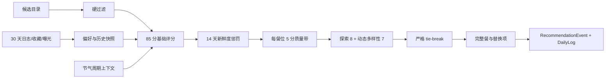

# rules_v6 推荐排序与 30 天偏好画像设计

## 1. 设计结论

采用“复用 `rules_v5` 管线、替换分数账本、合并重排逻辑”的增量方案，不另起一套推荐器。

`rules_v5` 已经具备硬过滤、推荐事件、近期历史、偏好快照、质量带探索、稳定哈希和按餐位组餐。真正需要修的是四处：`diversity=10` 目前对所有候选恒定相加；偏好/惩罚仍是 7 天；探索顺序会越过最终分与曝光距离；节气只在当天或“下一节气”二选一。再复制一个 `rules_v6_recommender.py` 只会制造两套逐渐互相打脸的规则。

## 2. 现有能力的取舍

| 现有机制 | 决策 | 原因 |
|---|---|---|
| `recommender.hard_filter` | 原样复用 | 已覆盖 `recipe_ready`、忌口、体质禁忌和明确排除食材 |
| `RankedCandidate` / `ScoreBreakdown` | 演进字段，不复制类型 | 继续作为评分与组餐之间的稳定边界 |
| `build_recommendation_history` | 扩为 30 天读取、14 天扣分 | 一个历史快照同时服务新鲜度、曝光距离和探索资格 |
| `build_preference_snapshot` | 扩展窗口与特征 | 保留 category/method/ingredient，增加 tag/nature |
| `apply_bounded_exploration` | 重构并并入统一 slate rerank | 现实现把 `selection_order` 放在最终分之前，不符合锁定 tie-break |
| `select_diverse` 与 `meal_builder` 做法去重 | 合并成一次动态重排 | 当前一个函数未走主链路，另一个只看做法，重复且语义分裂 |
| `CandidateReranker` | 保留扩展缝，不新增分数桶 | 本期默认仍为 identity；未来 Agent 只能在质量带内影响顺序 |
| `RecommendationEvent` / `DailyLog` | 原样复用 | 已能表示曝光与实际选择，无需迁移 |

## 3. 管线与边界



边界约束：

1. 硬过滤只发生一次且位于最前；后续阶段只接收安全 `food_id`。
2. 基础分只表达单候选相关性，最大 85。
3. 新鲜度是负向历史修正，不属于 15 分奖励预算。
4. 探索和多样性只在最终 slate 选择时产生，合计最多 15。
5. 组餐仍由 `meal_role_targets` 决定角色数量；重排不能改变角色需求。

## 4. 领域类型

### 4.1 分数分解

`ScoreBreakdown` 改为与产品权重同名的九个基础字段：

```python
@dataclass(frozen=True)
class ScoreBreakdown:
    nutrition: float
    constitution: float
    solar_term: float
    weather: float
    preference: float
    feasibility: float
    mood: float
    activity: float
    zodiac: float

    @property
    def total(self) -> float:  # clamp 前理论范围 0..85
        ...
```

`RankedCandidate` 保留 `food`、`reason_phrases` 和未来 reranker 元数据，增加：

- `novelty_penalty: float <= 0`
- `exploration_bonus: float in {0, 8}`
- `diversity_bonus: float in {0, 3.5, 7}`
- `exposure_distance_days: int`，30 天内未曝光使用哨兵 `30`
- `seed_rank: int`，SHA-256 前 8 字节转无符号整数

公式：

```text
base_score = clamp(sum(nine base components), 0, 85)
quality_score = base_score + novelty_penalty
final_raw_score = quality_score + exploration_bonus + diversity_bonus
normalized_score = round(clamp(final_raw_score, 0, 100), 2)
```

现有 `meal_intent_adjustment` 不再进入 `final_raw_score`；它只参与 feasibility 分项。`rerank_adjustment` 不再成为 `rules_v6` 的第三个加分桶。若未来启用非 identity reranker，其输出只能影响质量带内部顺序，不能越过硬过滤、质量带或 100 分上限。

### 4.2 历史快照

`RecommendationHistory` 扩展为：

```python
@dataclass(frozen=True)
class RecommendationHistory:
    chosen_days_ago: Mapping[int, int]
    exposed_days_ago: Mapping[int, int]
    exposure_counts_30d: Mapping[int, int]
    # 未曝光返回 30；不再需要独立 seen_today 硬删除分支
```

构建器读取 30 天数据，只保留每道菜最近的选择/曝光天数，同时累计 30 天曝光次数。`exclude_request_id` 继续用于幂等重放，客户端 `exclude_food_ids` 仍只合并为当天曝光提示，不能写进偏好画像。

### 4.3 偏好输入

`build_preference_snapshot` 的目标签名：

```python
def build_preference_snapshot(
    foods: Sequence[Food],
    logs_30d: Sequence[DailyLog],
    favorites_30d: Sequence[Favorite],
    events_30d: Sequence[RecommendationEvent],
    *,
    as_of: date,
    negative_signals: Sequence[ExplicitPreferenceSignal] = (),
) -> PreferenceSnapshot:
    ...
```

显式负反馈缝：

```python
@dataclass(frozen=True)
class ExplicitPreferenceSignal:
    food_id: int
    action: Literal["not_interested", "hide"]
    occurred_on: date
```

当前 `recommend()` 固定传空集合；本期不建表、不加路由。

## 5. 85 分基础评分

### 5.1 精确权重与复用方式

| 分项 | 上限 | rules_v6 计算 |
|---|---:|---|
| nutrition | 12 | 复用近 3 天营养互补 raw 0..15，线性缩放到 0..12 |
| constitution | 14 | 复用 raw 0/5/10，线性缩放为 0/7/14 |
| solar_term | 16 | 使用第 5.2 节周期档位 |
| weather | 4 | 复用天气 raw 3..15，线性缩放到 0.8..4；中性 raw 8 约 2.13 |
| preference | 15 | 7.5 中性基准 + 最多 7.5 正偏好 - 最多 4 显式负偏好 |
| feasibility | 14 | `scale(_score_method_time, 13, 12) + scale(meal_intent_delta, ±6, ±2)`，截断到 0..14 |
| mood | 5 | 复用 raw 0/12，线性缩放到 0/5 |
| activity | 3 | 复用 raw 0..5，线性缩放到 0..3 |
| zodiac | 2 | 复用 raw 0/3，线性缩放到 0/2 |

所有分项先单独截断再求和。这样任何一个 helper 出错都不能偷吃别人的预算。

### 5.2 节气周期

在 `solar_terms.py` 新增仅供排序使用的不可变 `SolarTermCycle`，不改 `TodayContext.solar_term_current` 的“仅节气当天有值”语义：

```python
@dataclass(frozen=True)
class SolarTermCycle:
    active_name: str
    active_date: date
    next_name: str
    next_date: date
    elapsed_days: int
    cycle_days: int
    phase_index: int  # 0, 1, 2
```

实现使用 `lunar-python` 的 `getPrevJieQi(whole_day=True)` / `getNextJieQi(whole_day=True)`。节气当天以 `getJieQi()` 为新 active term，并从次日对象读取真正的下一节气，防止 prev/next API 在边界日都返回当天对象。

周期档位按比例而非固定 5 天切分，避免 14～16 天周期边界漂移：

```text
phase_index = min(2, floor(3 * elapsed_days / max(cycle_days, 1)))

                 前段     中段     后段
active term       16       12        8
next term          0        4        8
```

食物同时命中 active/next 时取 `max`，不累加。未标节气为 0。周期 helper 按 ISO 日期缓存，测试用固定 `datetime` 注入。

## 6. 30 天偏好画像

### 6.1 窗口与信号

窗口为 `[as_of - 29 天, as_of]`，两端包含。

| days_ago | 衰减系数 |
|---:|---:|
| 0～6 | 1.0 |
| 7～13 | 0.8 |
| 14～20 | 0.6 |
| 21～29 | 0.4 |
| ≥30 | 0 |

证据权重：

```text
favorite_weight = 2.0 * recency_decay
chosen_weight = 1.0 * recency_decay / sqrt(max(1, exposure_count_30d[food_id]))
```

收藏是显式正反馈，不做曝光衰减；选择是只可能发生在曝光后的隐式反馈，用平方根做保守降权。这个公式只是防止自我强化的启发式阻尼，不宣称完成 propensity/因果去偏。

曝光未选贡献 0；客户端排除贡献 0；未知或已删除 food id 忽略。一个 food 的多标签/多食材权重按唯一值均分，避免标签写得多就凭空获得更多证据。

### 6.2 特征与 15 分映射

`PreferenceSnapshot` 保留现有三张 affinity map，并增加 `tag_affinity` 与 `nature_affinity`。各轴按本轴峰值归一化，正向 bonus cap 为：

| 轴 | bonus cap |
|---|---:|
| category | 1.5 |
| cooking_method | 1.5 |
| nature | 1.5 |
| tags（候选命中最高两个） | 2.0 |
| ingredients（候选命中最高两个） | 1.0 |
| **合计** | **7.5** |

```text
preference_score = clamp(7.5 + positive_bonus - explicit_negative_penalty, 0, 15)
```

当前运行时无显式负反馈，所以冷启动为 7.5，有有效正反馈时范围 7.5..15。未来 `not_interested` / `hide` 使用相同 30 天衰减建立独立 negative maps，动作基础权重分别为 1 和 2，总负向扣分封顶 4；它们不能生成硬过滤标签。

### 6.3 查询边界

- `daily_service.get_recent(..., days=30, as_of=today)`：增加 `as_of`，避免函数内部偷偷读系统日期导致测试漂移。
- `daily_service.get_recent_recommendation_events(..., days=30, as_of=today)`：现接口已参数化，只改调用窗口。
- `favorite_service.list_recent_favorites(..., days=30, as_of=today)`：返回 `Favorite` 行而非只有 id，使收藏可按 `created_at` 衰减；SQLite/SQLModel 与 CloudBase Repository 使用相同闭区间语义。
- 仍维持推荐热路径最多 5 次读：profile、30 天 logs、30 天 events、catalog、30 天 favorites。

## 7. 14 天新鲜度

同日统一使用 `-45`。第 1～13 天使用公式而不是手写两张容易错位的数组：

```text
chosen(d)  = -round(32 * (14 - d) / 13, 2), d in 1..13
exposed(d) = -round(16 * (14 - d) / 13, 2), d in 1..13
repeat_extra = -min(12, 4 * (exposure_count_30d - 1))
```

第 14 天及更早为 0。曝光惩罚可叠加 `repeat_extra` 后再参与“取最强项”，但 chosen/exposed/today 彼此不相加：

```text
novelty_penalty = min(today_penalty, chosen_penalty, exposed_penalty_with_repeat, 0)
```

不再在候选足够时硬删除当天曝光菜。`-45` 通常足以把它压到底部，安全角色候选不足时又能自然回补，逻辑比“有时删除、有时扣分”少一张隐藏彩票。

## 8. 质量带、探索、多样性与 tie-break

### 8.1 每餐位质量带

对当前待填 `meal_role` 的未选候选计算：

```text
quality_score = base_score + novelty_penalty
role_peak = max(quality_score)
in_quality_band = quality_score >= role_peak - 5.0
```

仅 `in_quality_band` 且 `exposed_days_ago` 不存在的候选获得 `exploration_bonus=8`。质量带外候选永远为 0，即使它 30 天没曝光；探索池为空时也不扩大阈值。

### 8.2 动态多样性

按 `meal_role_targets` 的既有顺序逐个填槽位。相对当前已选集合：

```text
diversity_bonus =
    3.5 if category not used else 0
  + 3.5 if cooking_method not used else 0
```

首个槽位所有候选均视为新 category/new method，统一得 7，因此不会改变首位相关性。后续候选通过 0/3.5/7 表达多样性价值；不再做硬拒绝，所以多人套餐或稀缺角色仍能完成。

### 8.3 严格排序键

`final_score` 先四舍五入到两位，再构造：

```python
(
    -final_score,
    -exposure_distance_days,  # 30 天未曝光 = 30
    stable_seed_rank,         # sha256(user|date|request_seed|food_id)
    food.id,
)
```

请求没有 `request_id` 时继续生成 `effective_request_id` 作为 request seed；有 `request_id` 的重试复用同一 seed。稳定哈希不使用 Python `hash()`，避免进程重启后盐值变化。

`meal_builder._selection_key` 不得再把 `selection_order` 放在最终分之前。主餐与替换项都复用同一个 rules_v6 key，避免主餐看分、替换项看 id 的精神分裂。

## 9. API 与持久化

- `RecommendResponse.engine = "rules_v6"`。
- `RecommendationEvent.engine/scorer_version = "rules_v6"`，`builder_version` 保持现有值，便于区分评分和组餐版本。
- `FoodWithReason.score` 继续为 0～100 两位小数；推荐理由只使用真实命中的基础分项，不宣传“因为你 30 天没见过它所以推给你”。
- `RecommendationWeightProfile` 保留旧聚合键：
  - `nutrition=12`
  - `seasonal_wellness=20`（solar 16 + weather 4）
  - `personal_family=24`（constitution 14 + mood 5 + activity 3 + zodiac 2）
  - `preference_history=15`
  - `feasibility=14`
  - `diversity=7`
- 新增明细键 `solar_term=16`、`weather=4`、`constitution=14`、`mood=5`、`activity=3`、`zodiac=2`、`exploration=8`；`weather_modifier_limit` 兼容键更新为 4。
- 不改表结构。30 天窗口直接使用现有 `DailyLog`、`RecommendationEvent`、`Favorite.created_at`。

未来负反馈 HTTP 形状建议为：

```json
{
  "recommendation_id": 123,
  "food_id": 456,
  "action": "not_interested"
}
```

服务端必须从事件快照验证 user ownership、food membership 和展示位置，不能信任客户端自报。要做真正的离线无偏评估，还需记录展示位置和当次探索概率；本任务不加这层数据。

## 10. 文件职责

| 文件 | 计划职责 |
|---|---|
| `backend/app/services/recommendation_ranking.py` | v6 权重、历史、偏好、14 天惩罚、质量带、动态多样性、tie-break 纯函数 |
| `backend/app/services/recommender.py` | 九项基础分映射、拉取 30 天上下文、串联重排并写 `rules_v6` |
| `backend/app/services/solar_terms.py` | `SolarTermCycle` 与按日期缓存的周期计算 |
| `backend/app/services/daily_service.py` | `get_recent` 增加 `as_of`，复用现有 30 天查询能力 |
| `backend/app/services/favorite_service.py` | 跨 SQLite/CloudBase 的近 30 天收藏行查询 |
| `backend/app/services/meal_builder.py` | 使用统一 v6 排序键完成主餐和替换项，不再优先 `selection_order` |
| `backend/app/schemas/daily.py` | 兼容扩展 `RecommendationWeightProfile` |
| 对应 `backend/tests/services/*` 与 `backend/tests/test_api_v1/test_daily.py` | TDD 行为锁定与契约回归 |

## 11. 失败与降级

- 无 profile：维持现有 `NotFoundError`。
- 全部候选被硬过滤：维持现有 `ValidationError`。
- 某餐位候选不足：维持组餐器明确错误，不复制、不跨角色偷菜。
- 天气失败：中性天气，weather 分保持中性，不阻断。
- 画像历史为空或引用已删除 food：忽略无效 id，偏好回 7.5。
- 节气库边界计算异常：记录结构化 warning，回退当前 `TodayContext` 的“当日/下一节气”保守评分；不能让历法彩蛋拖垮早餐。
- 非 identity reranker 异常：继续回退纯 rules_v6，但不得恢复旧 `rules_v5` 权重。

## 12. 发布、观测与回滚

### 发布

1. 先通过纯函数、service、API 和完整测试。
2. 预发布记录 `engine=rules_v6` 的分项边界、30 天画像命中数、质量带大小、探索池大小、各候选 penalty/bonus；日志只写计数与 food id。
3. 完成同请求幂等、连续换餐、历史 14/30 天边界和 200 候选性能验收后再发布。

### 观测指标

- 同日重复率、14 天重复率；
- 单餐 category/method distinct count；
- quality-band size 与 exploration eligible rate；
- 冷启动画像占比、各特征轴命中率；
- 推荐总耗时与数据库 select 次数；
- `rules_v6` fallback 次数。

### 回滚

本期无迁移，代码回滚即可。历史事件保留其真实 `engine/scorer_version`，不得批量改写为旧版本。回滚后 `rules_v5` 仍能读取同一事件表；新增 `weight_profile` JSON 键由客户端忽略，不需要数据回滚。
