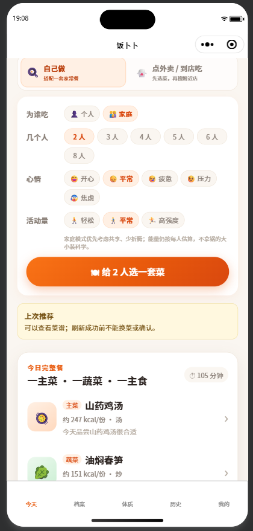
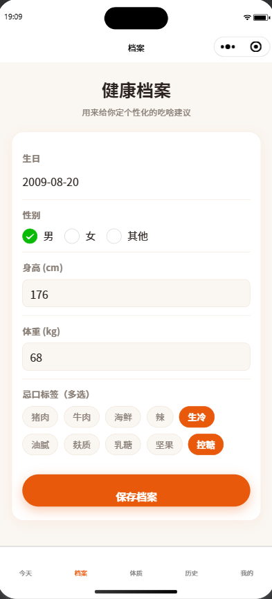
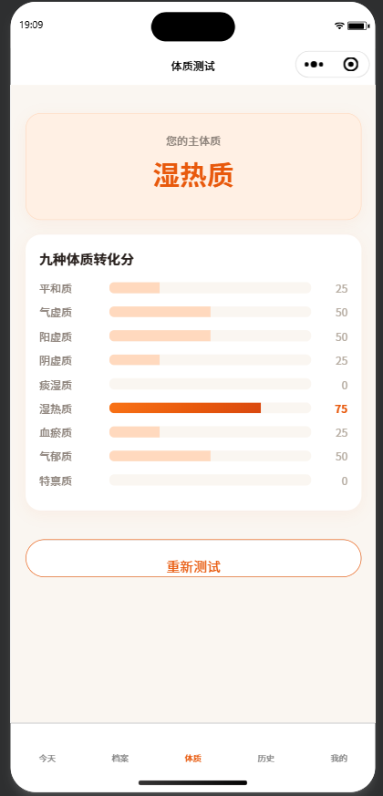
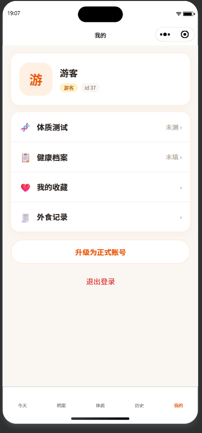
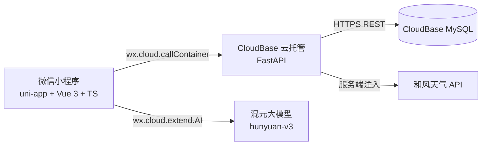

<p align="center">
  
</p>

<h1 align="center">饭卜卜 Eat-What</h1>

<p align="center">
  今天吃啥嘞？卜一卜 → 补一补。<br/>
  根据人数、做饭/外食场景、心情、活动量、忌口、体质、节气与天气，推荐更合适的一餐。
</p>

<p align="center">
  
  
  
  
  
</p>

<p align="center">
  
  
  
</p>

---

## 产品截图

<table>
  <tr>
    <td align="center"><br/><sub>完整餐盘推荐</sub></td>
    <td align="center"><br/><sub>健康档案与忌口</sub></td>
    <td align="center"><br/><sub>九种体质测试</sub></td>
    <td align="center"><br/><sub>微信一键登录</sub></td>
  </tr>
</table>

## 功能亮点

### 🍳 智能餐食推荐
- 一人/家庭模式的完整餐盘推荐（主菜 + 蔬菜 + 主食）与单项替换
- 结合心情、活动量、忌口、体质、节气、天气的规则引擎评分与多样性轮换
- 近期去重、多轮轮换，推荐历史可追溯当时的餐单快照

### 🤖 AI 能力
- 「冰箱里有什么？几分钟？想怎么吃？」AI 用餐意图输入，实时转成推荐约束
- AI 一句话自记：「早上吃了小笼包和豆浆」→ 自动解析餐次、菜品与能量
- 按城市推荐本地特色菜（服务端缓存 24h、防幻觉校验、静默降级兜底）
- AI 全程可用性兜底：模型不可用时基础规则推荐不受影响

### 📖 餐食日记与三餐化
- 早 / 中 / 晚三餐独立记录，推荐选择 upsert 覆盖、手动自记可一餐多条
- 按天时间线 + 月历视图双模式，按当日心情上色，连续打卡火焰徽章
- 外食正交标记：点外卖也算「今天吃了饭」，与外食小本联动跳转

### 🥡 外食小本与收藏
- 店铺＋菜品颗粒度的「喜欢 / 一般 / 避雷」记忆，反哺推荐与排雷
- 收藏支持搜索、备注、自定义收藏；外食小本支持搜索与按日期过滤

### 🛡 账号与隐私
- 微信一键登录与游客模式全功能可用，注册后自动合并游客数据
- 拒绝定位时手动填写城市；天气不可用降级而不阻断推荐

## 技术架构



```text
微信小程序（uni-app + Vue 3 + TypeScript）
  -> wx.cloud.callContainer
  -> CloudBase 云托管（FastAPI + SQLModel + Alembic）
  -> CloudBase MySQL HTTPS REST API
```

生产环境不使用公网 MySQL TCP 连接，也不需要单独购买 VPS。微信 AppSecret 不进入前端、Git 或当前可信身份头登录链路。

## 目录结构

```text
miniapp-trellis/
├── miniapp/                  # uni-app 微信小程序前端（页面、组件、store、AI 模块）
├── backend/                  # FastAPI 后端、Alembic 迁移、种子数据与测试
├── docs/guides/              # 部署、微信工具和验收指南
├── docs/plans/               # 仍有参考价值的方案记录
├── eat_what_brand_assets/    # 品牌视觉素材
├── .trellis/                 # Trellis 工程规范与任务记录（含 archive）
└── .opencode/                # opencode 集成
```

## 快速开始

### 后端

```bash
cd backend
python3 -m venv .venv
source .venv/bin/activate
pip install -e ".[dev]"
cp .env.example .env
alembic upgrade head
eat-what seed-all
uvicorn app.main:app --reload --port 8000
```

### 小程序

```bash
cd miniapp
npm ci
npm run dev:mp-weixin
```

微信开发者工具应导入 `miniapp/dist/dev/mp-weixin`，不要导入仓库根目录或 `miniapp/src`。

## 质量保障

| 端 | 检查项 | 命令 |
|---|---|---|
| 后端 | 430 项测试 + ruff + mypy | `pytest -q && ruff check . && mypy app` |
| 前端 | 128 项 vitest + 类型检查 + lint | `npm test -- --run && npm run type-check && npm run lint` |
| 构建 | 微信小程序产物 | `npm run build:mp-weixin && test -f dist/build/mp-weixin/app.json` |

部署后还必须运行 CloudBase REST 读写契约验证和微信开发者工具真实预览；本地测试通过不能代替云端验收。

## 部署与运维

- [CloudBase 云托管部署](docs/guides/cloudbase-cloudrun-deploy.md)
- [Windows 微信开发者工具 + WSL](docs/guides/wechat-devtools-wsl.md)
- [菜谱与完整餐盘验收](docs/guides/meal-recipe-acceptance.md)
- [后端说明](backend/README.md)

发布压缩包、`dist`、`node_modules`、本地数据库、`.env`、微信工具私有配置和 Agent 运行状态都不提交 Git。生产密钥只由 CloudBase 服务端环境变量/API Key 注入。

## License

[AGPL-3.0](LICENSE)
